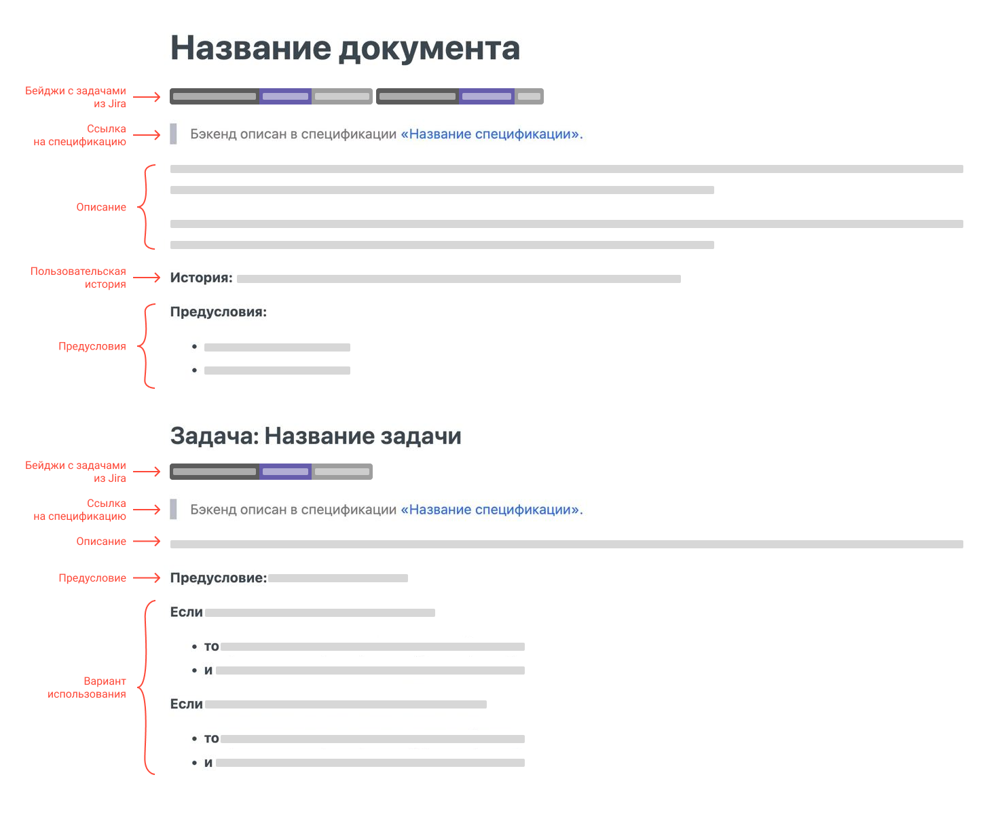
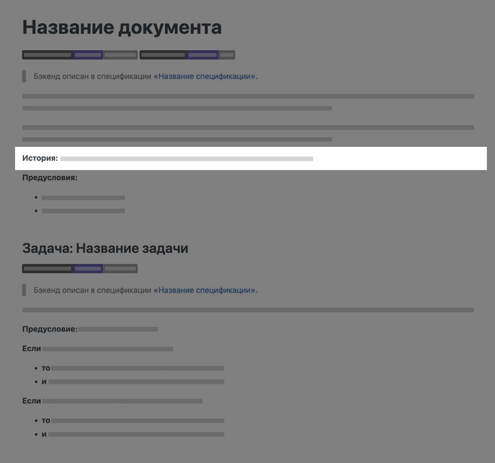

# Разработка шаблона документа

Шаблон документа — это инструкция, которая показывает: из каких частей состоит документ, зачем они нужны, а также как оформить каждую часть.

Шаблоны помогают сделать документацию единообразнее, а также ускоряют ее разработку.
Для авторов шаблоны полезны тем, что помогают сконцентрироваться на содержании документа, а не его оформлении.

Шаблоны могут разрабатываться, когда документации еще нет, а также на основе существующих документов.
В этой статье будет описано, как создать шаблон для пользовательских историй на основе существующей документации.

## Легаси

Легаси — в нашем случае это массив уже созданной документации.
Когда легаси объемное лучше не игнорировать его и не переучивать авторов писать по-новому.
Эффективнее будет заимствовать и дорабатывать.

Перед созданием шаблона для пользовательских историй мы заметили, что в большинстве документов этого типа присутствуют одинаковые элементы.
Однако от документа к документу эти элементы были перепутаны местами, оформлены иначе, назывались по-разному, а иногда отсутствовали.
Из всего этого нужно было собрать самый удачный вариант, доработать и презентовать.

## План разработки

1. Собрать информацию об этом типе документа:
    - зачем пишут;
    - кто читает;
    - типовые ситуации, которые описываются;
2. Найти и проанализировать все элементы, которые повторяются из документа в документ.
3. Узнать, зачем нужен каждый элемент, что в нем описывается.
4. На основе полученных данных продумать структуру и внешний вид (подробнее об этом в следующем разделе).
5. Протестировать на существующих документах, попробовать переписать их по шаблону.
6. Презентовать и собрать обратную связь.
7. Поправить.
8. Использовать.


## Структура шаблона

Шаблон состоит из трех основных блоков: вступление, разбор отдельных элементов, шаблоны блоков.

### Вступление

Во вступлении полезно рассказать:

- что описывается в документе,
- зачем такие документы нужны,
- важные составляющие документа,
- на какие вопросы подобные документы отвечают,
- кто читает эти документы.

???+ example "Пример вступления"

    Пользовательские истории — это документы, в которых описывают логику работы приложения с одной из сторон:
    
    - с точки зрения пользователя с определенной ролью (это может быть гость, администратор и т.д.);
    - на уровне клиентских приложений и устройств.
    
    Пользовательские истории нужны для понимания того, что пользователь делает в приложении, как оно работает, что обеспечивает именно такую работу.

    **Важные составляющие пользовательских историй:**

    - История (user story) — в общих терминах «пользовательская история», это краткая формулировка намерения, которая описывает, что система должна делать для пользователя.
    - Задача (task) — это составная часть пользовательской истории, которая детально раскрывает взаимодействие с функционалом приложения, и которую необходимо реализовать.
    - Вариант использования (use case) — это сценарий, который описывает, какие действия выполняет пользователь или приложение, и как система должна на них реагировать.
    
    **Типовые вопросы, на которые отвечают пользовательские истории:**

    - Что отображается в приложении.
    - Что делает пользователь, и как на это реагирует приложение.
    - Что приложение отправляет на бэкенд, что получает в ответ, что показывает пользователю.

    > В историях не описывается взаимодействие приложения с базой данных.
    > Из каких таблиц приложение с помощью API-методов получает данные, описывается в спецификациях.

### Разбор отдельных элементов {#elements}

Как правило, типовые документы состоят из повторяющихся элементов.
Перед тем, как подробно разбирать каждый элемент, будет полезно их перечислить и визуально показать их расположение при помощи «скелета» документа.
Такое верхнеуровневое описание поможет быстро вспомнить структуру, а не перечитывать документ каждый раз.

???+ example "Пример верхнеуровневой структуры"

    Большинство пользовательских историй состоит из двух частей: вступление и задача.
    Вступление в документе одно, а задач – несколько.
    Каждая часть состоит из набора элементов, которые представлены ниже.
    
    Вступление:
    
    - бейдж с задачей из Jira,
    - ссылка на спецификацию,
    - описание,
    - пользовательская история,
    - предусловия (общие).
    
    Задача:
    
    - бейдж с задачей из Jira,
    - ссылка на спецификацию,
    - описание,
    - предусловия (частные),
    - вариант использования.
    
    
    
    Во вступлении пользовательских историй, которые написаны с точки зрения пользователя, должна быть история и предусловия.
    В задаче все элементы, кроме варианта использования, опциональные.

    > Рекомендуется соблюдать порядок элементов документа, который представлен в этом разделе.
    > Это сделает истории единообразными и упростит их восприятие.

Затем следует расписать каждый элемент: показать его расположение, что в нем описывается, как это лучше делать, а также пример оформления этого элемента.

???+ example "Пример оформления элемента"

    
    
    Пользовательская история (user story) — это краткая формулировка намерения, которая описывает, что система должна делать для пользователя.
    
    Истории пишутся на основе бизнес-задачи, как правило, с точки зрения пользователя, его потребностей или желаний.
    Рекомендуется придерживаться следующей формулировки: я, как <роль>, хочу <описание функциональности>, чтобы <результат> (последнее опционально).
    
    *Пример оформления:*
    
    - **История:** я, как зарегистрированный пользователь, хочу получать рекомендации контента.
    - **История:** я, как пользователь Wink, хочу получать спецпредложения и скидки из рекламы в ТВ-плеере.
    
    !!! note "Примечание"
    
        Иногда пользовательская история может отсутствовать.
        Например, когда функциональность техническая или она обусловлена бизнес-задачами (рост продаж).
        В этом случае не получится писать с точки зрения пользователя.

### Шаблоны блоков {#blocks}

Несколько элементов образуют блок, если они повторяются из документа в документ, имеют одинаковое оформление, смысл и т.д.
Для таких повторяющихся блоков полезно создавать шаблоны, чтобы автор мог скопировать его, вставить к себе в документ и заполнить нужными данными.

Полезно, если такой блок будет сопровождаться примером отображения и, для большей наглядности, примером из документации (пример из нашей документации не приведен из этических соображений).

???+ example "Пример шаблона вступительного блока"

    === "Исходный код"

        ```markdown
        # Название истории
        
        `WINKDEV-14930` `WINKDEV-5757`
        
        > Бэкенд описан в спецификации [«Название спецификации».](./#blocks)
        
        Текст с описанием истории.
        Может быть небольшим или состоять из нескольких абзацев.
        В этом тексте не используются дополнительные подзаголовки, но можно использовать обычные элементы текста:
        
        - список,
        - плашку,
        - цитату,
        - таблицу,
        - блок кода,
        - и даже шорткод.
        
        **История:** я, как <роль>, хочу <описание функциональности>, чтобы <эффект>.
        
        **Предусловия:**
        
        - Первое предусловие.
        - Второе предусловие.
        - Третье предусловие.
        ```

    === "На сайте"

        <h3>Название истории</h3>
        
        `WINKDEV-14930` `WINKDEV-5757`
        
        > Бэкенд описан в спецификации [«Название спецификации».](./#blocks)
        
        Текст с описанием истории.
        Может быть небольшим или состоять из нескольких абзацев.
        В этом тексте не используются дополнительные подзаголовки, но можно использовать обычные элементы текста:
        
        - список,
        - плашку,
        - цитату,
        - таблицу,
        - блок кода,
        - и даже шорткод.
        
        **История:** я, как <роль>, хочу <описание функциональности>, чтобы <эффект>.
        
        **Предусловия:**
        
        - Первое предусловие.
        - Второе предусловие.
        - Третье предусловие.

Перед презентацией шаблона команде полезно протестировать его на нескольких документах из вашей документации.
Эти документы также полезно приложить к шаблону, чтобы ими могли воспользоваться, если что-то в оформлении окажется непонятным.

## Что важно понимать

Шаблон документа — это не только заготовка текста с пропусками для заполнения нужной информацией.
Шаблон дает общее понимание о специфике и структуре документа: зачем и для кого такой документ пишется, почему состоит именно из таких элементов и т.д.

Для универсальности шаблона всего документа, чтобы он покрывал большую часть сценариев, полезно разделить шаблон на несколько отдельных элементов или блоков.
А затем расписать как, зачем и в какой последовательности их использовать.

